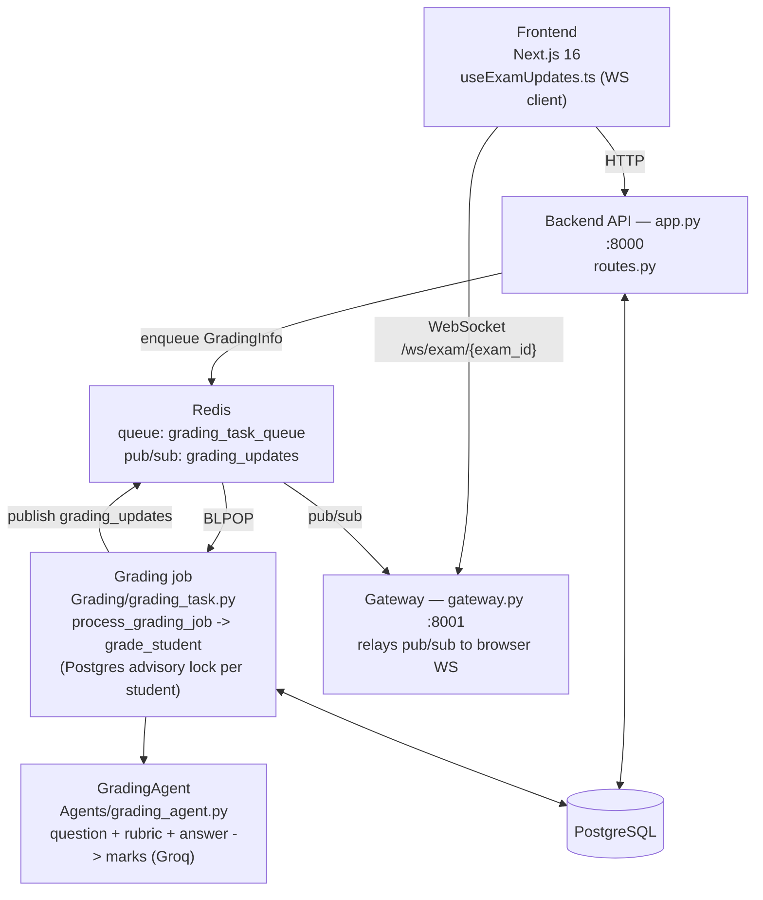
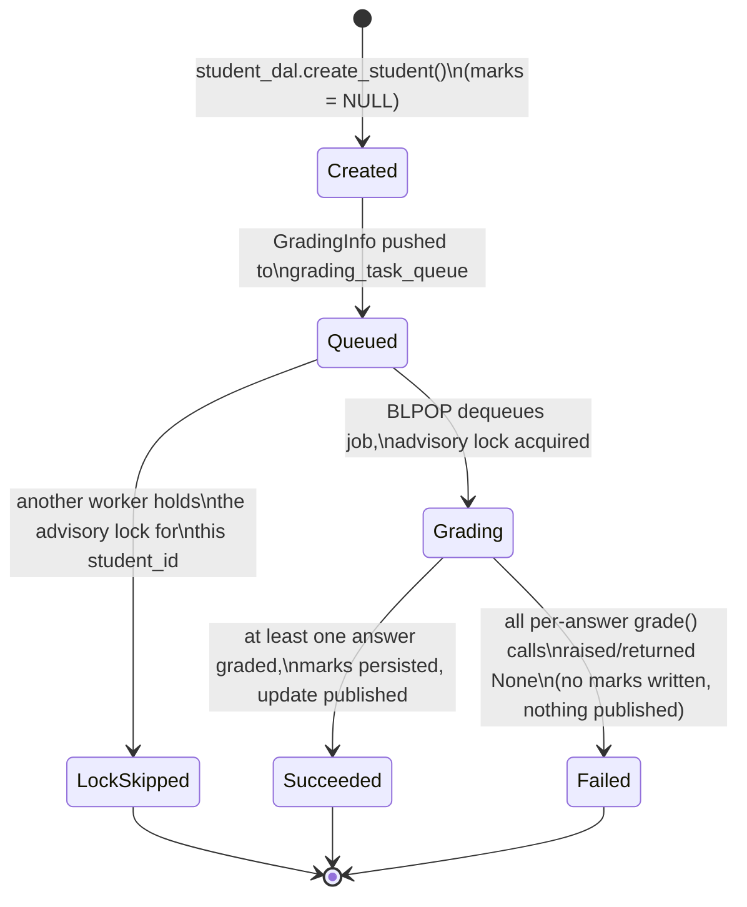
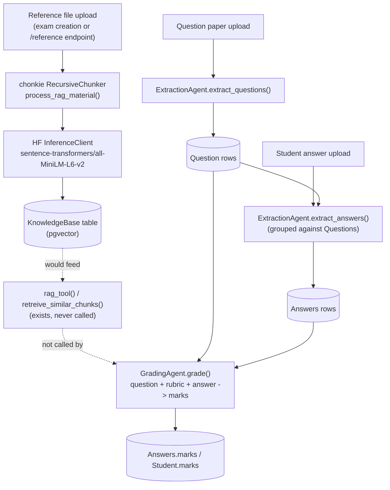

# InkGrader Architecture

AI-powered grading of handwritten exam submissions: OCR extraction + LLM scoring, queued through Redis, pushed live to the frontend over WebSocket.

## Components

Three deployables:

1. **Frontend** — Next.js 16 app (browser + Next server)
2. **Backend API** — FastAPI app (`backend/app.py`), port 8000
3. **Gateway** — FastAPI WebSocket relay (`backend/gateway.py`), port 8001

Shared infrastructure: PostgreSQL (with `pgvector`) and Redis.

## Request flow: submitting answers

1. Browser uploads a student's answer file(s) to the frontend, which proxies to the backend via `app/api/proxy/exam/[id]/answers/route.ts` → `POST /api/exam/{exam_id}/answers` on `app.py`.
2. `routes.py` creates a `Student` row, kicks off OCR + `ExtractionAgent` extraction in the background, then enqueues a `GradingInfo` job on Redis (`Grading/queue.py`, list `grading_task_queue`).
3. The grading worker — an asyncio task spawned in-process by `app.py` at startup (`run_grading_worker`) — `BLPOP`s the queue and calls `process_grading_job`.
4. `grading_task.py` fans out over the job's students with `asyncio.gather`. Each student is graded under a Postgres advisory lock (`Database/locks.py`, keyed on `student_id`) to prevent double-grading races; within a student, answers are graded concurrently via `GradingAgent.grade()`.
5. Marks are persisted to `Answers`/`Student` via the DAL layer, then a completion payload (`exam_id`, `student_id`) is published to the Redis `grading_updates` channel.
6. `gateway.py` (separate process, port 8001) is subscribed to that channel and relays the payload to every browser WebSocket connected on `/ws/exam/{exam_id}`.
7. In the frontend, `hooks/useExamUpdates.ts` (client-only) receives the message and calls `queryClient.invalidateQueries(["exam-students", examId])`, refetching the *whole* student list for that exam — not scoped per-student, so many students finishing close together causes redundant refetches.

## Frontend detail

- `app/` — route groups: `(landing_page)`, `home`, `login`, `signup`.
- `app/api/proxy/exam/...` — Next-side routes that forward exam CRUD, answers/questions/rubrics/reference uploads, status, and student reads to the backend API.
- `app/api/auth/[...all]` — Better Auth handler.
- `app/api/webhook/results` — inbound webhook endpoint.
- `drizzle/` + `auth-schema.ts` — Drizzle ORM schema for Better Auth's own tables, separate from the backend's SQLAlchemy/Postgres grading data.
- `components/` — shadcn/ui-based (`ui/`, `dashboard/`, `providers/`).
- No test runner configured yet (no jest/vitest) — frontend changes are currently unverified by automated tests.

## Backend detail

- `app.py` — main API process, port 8000. Owns the Postgres engine/schema setup and spawns the grading worker as a background asyncio task.
- `gateway.py` — separate process, port 8001. Stateless relay: no DB access, no queue writes, just Redis pub/sub → WebSocket fan-out per `exam_id`.
- `routes.py` — HTTP endpoints under `/api/exam` prefix: exam creation, answers/reference submission, student/exam/result reads.
- `Agents/` — Groq LLM wrappers (`extraction_agent.py`, `grading_agent.py`), prompt/schema definitions (`prompts.py`, `models.py`). `tools.py` defines `rag_tool()` (pgvector similarity search) — not wired into any Groq call.
- `FileProcessor/` — PDF/image parsing and OCR.Space integration.
- `Grading/` — `queue.py` (Redis BLPOP job queue + pub/sub publish), `grading_task.py` (per-student grading orchestration).
- `Database/` — SQLAlchemy 2.0 models + one DAL per model, plus `locks.py` (Postgres advisory lock).
- `tests/` — pytest + pytest-asyncio (`uv run pytest` from `backend/`).

## Why two backend processes

`app.py` and `gateway.py` are deployed separately so a WebSocket-heavy connection load on the gateway can scale independently of the grading/API workload, and so a gateway restart doesn't drop in-flight grading jobs (the queue lives in Redis, not in either process's memory).

## Job lifecycle (per student)

There's no stored status column for this — it's inferred from control flow (`Student.marks` is just `NULL` until graded). Shown here as states for clarity.

## RAG grading pipeline — designed vs. actually wired

**Ingestion (implemented and active):** an optional reference file, uploaded at exam creation (`POST /api/exam/`) or later (`POST /api/exam/{id}/reference`), is chunked and embedded, then stored in Postgres.

**Chunking:** `process_rag_material()` (`FileProcessor/utils.py`) uses chonkie's `RecursiveChunker(chunk_size=1000)` — the tokenizer arg is left at its default (`"character"`), so `chunk_size` counts characters, not tokens. It's not a fixed-width splitter: `RecursiveChunker` splits text through an ordered list of separator levels, trying the coarsest first and only falling through to finer ones where a piece still exceeds `chunk_size`:
1. paragraph breaks (`\n\n`, `\r\n`, `\n`, `\r`)
2. sentence enders (`. `, `! `, `? `)
3. punctuation/brackets (`{`, `}`, `,`, `;`, `-`, quotes, etc.)
4. whitespace
5. raw characters (last-resort fallback)

Each resulting chunk (min 24 characters, chonkie's default floor) becomes one `KnowledgeBase` row, embedded with `sentence-transformers/all-MiniLM-L6-v2` via the HF Inference API.

**Retrieval (implemented but not connected to grading):** `Agents/tools.py` has `rag_tool()` / `retreive_similar_chunks()`, which embeds a query and does a pgvector cosine-distance lookup against `KnowledgeBase` for an exam. Nothing calls it — `GradingAgent.grade()` (`Agents/grading_agent.py`) only ever receives the question text, topic, rubric, and student answer. `grading_task.py` never builds a query embedding or calls `retreive_similar_chunks`. So today, grading runs with **zero retrieval augmentation**, regardless of whether a reference file was uploaded.

