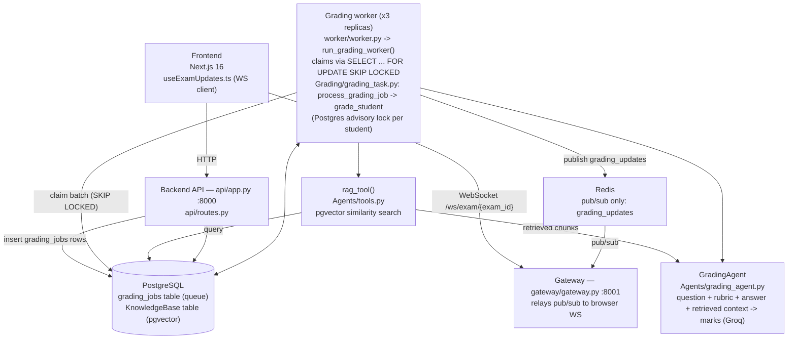
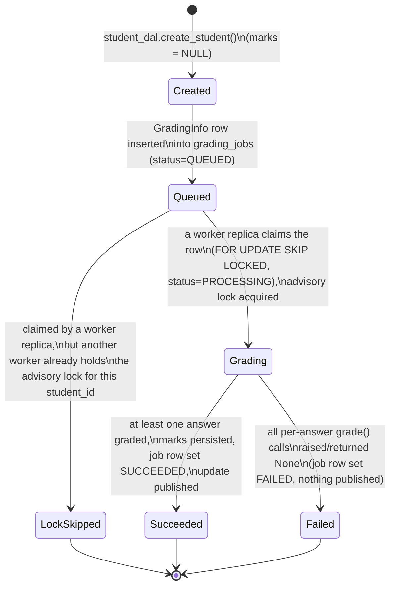
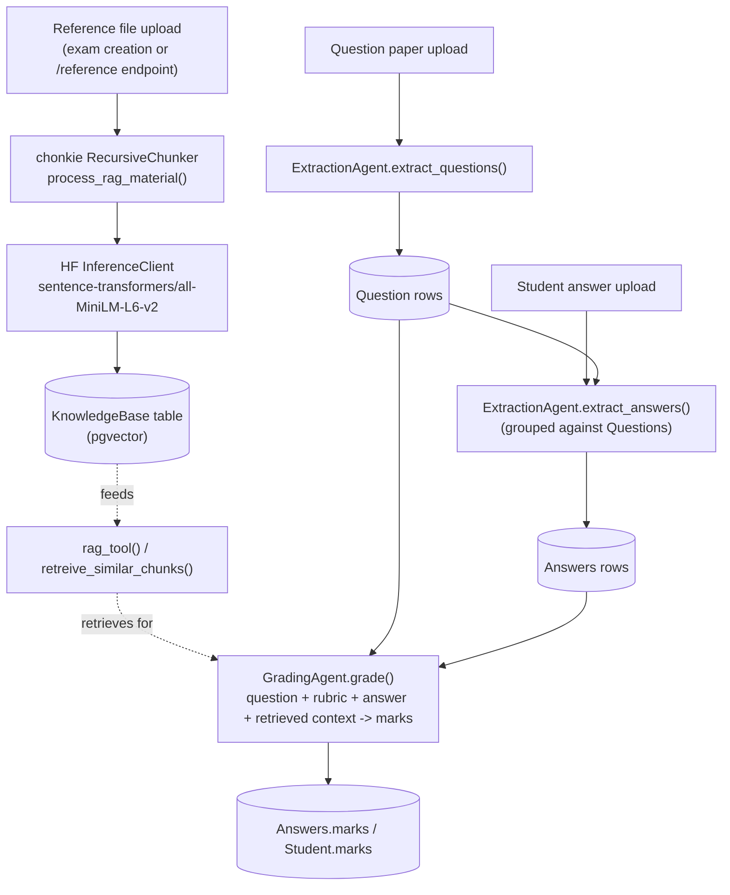

# InkGrader Architecture

AI-powered grading of handwritten exam submissions: OCR extraction + LLM scoring, queued through Postgres and graded by a replicated worker pool, pushed live to the frontend over WebSocket via Redis pub/sub.

## Frontend ↔ backend connection architecture

The frontend never talks to the backend's Postgres/Redis directly — it only ever calls two backend HTTP/WS surfaces, both through Next.js server-side proxy routes so backend URLs/credentials stay off the browser:

- **HTTP (CRUD, uploads, reads)**: browser → Next.js server route under `app/api/proxy/exam/...` → `POST/GET` on `api/app.py` (`api/routes.py`), port 8000. Covers exam creation, question/rubric/answer/reference uploads, exam and student reads.
- **WebSocket (live grading updates)**: browser opens `/ws/exam/{exam_id}` directly against the gateway process (`backend/gateway/gateway.py`, port 8001) via `hooks/useExamUpdates.ts` (client-only). The gateway has no HTTP API of its own and no dependency on `core` — it exists purely to fan grading-completion events (relayed from Redis pub/sub) out to connected browsers, decoupled from the API's HTTP/extraction workload.
- **Auth**: handled separately, in Next.js itself — `app/api/auth/[...all]` (Better Auth) against its own Drizzle-managed tables, unrelated to the backend's SQLAlchemy/Postgres grading schema.

So there are two independent frontend-to-backend links (HTTP to `api`, WebSocket to `gateway`) rather than one, and the frontend never sees the Postgres job queue or Redis channel that connect `api`/`worker`/`gateway` to each other — see the flowchart below.

## Components

Four deployables, one shared library:

1. **Frontend** — Next.js 16 app (browser + Next server)
2. **Backend API** — FastAPI app (`backend/api/app.py`), port 8000
3. **Grading worker** — `backend/worker/worker.py`, no HTTP surface, run at **3 replicas** (`docker-compose.yml`, `grading-worker` service, `deploy.replicas: 3`)
4. **Gateway** — FastAPI WebSocket relay (`backend/gateway/gateway.py`), port 8001

`backend/core/` (`inkgrader-core`) is shared business logic — not a process of its own. `api` and `worker` depend on it as a local `uv` workspace package; `gateway` has zero dependency on it (it only ever touched Redis pub/sub and FastAPI) and ships its own minimal image.

Shared infrastructure: PostgreSQL (with `pgvector`, also the grading job queue) and Redis (pub/sub only).

## Request flow: submitting answers

1. Browser uploads a student's answer file(s) to the frontend, which proxies to the backend via `app/api/proxy/exam/[id]/answers/route.ts` → `POST /api/exam/{exam_id}/answers` on `api/app.py`.
2. `api/routes.py` creates a `Student` row, kicks off OCR + `ExtractionAgent` extraction in the background, then enqueues a `GradingInfo` job by inserting rows into the Postgres `grading_jobs` table (`Grading/queue.py`, `enqueue_grading_job` → `GradingJobDAL.enqueue_batch`).
3. One of the **3 `grading-worker` replicas** — each a standalone process running `worker/worker.py` → `run_grading_worker()`, entirely separate from the API process — polls `grading_jobs` and claims a batch via `SELECT ... FOR UPDATE SKIP LOCKED` (`GradingJobDAL.claim_batch`), which guarantees no two replicas claim the same row.
4. `grading_task.py` fans out over the claimed batch's students with `asyncio.gather`. Each student is graded under a Postgres advisory lock (`Database/locks.py`, keyed on `student_id`) — this is what stops two replicas from double-grading the same student if a job were ever claimed twice; within a student, answers are graded concurrently via `GradingAgent.grade()`.
5. Marks are persisted to `Answers`/`Student` via the DAL layer, the job's `grading_jobs` row is marked `SUCCEEDED`/`FAILED`, then a completion payload (`exam_id`, `student_id`) is published to the Redis `grading_updates` channel.
6. `gateway/gateway.py` (separate process, port 8001) is subscribed to that channel and relays the payload to every browser WebSocket connected on `/ws/exam/{exam_id}`.
7. In the frontend, `hooks/useExamUpdates.ts` (client-only) receives the message and calls `queryClient.invalidateQueries(["exam-students", examId])`, refetching the *whole* student list for that exam — not scoped per-student, so many students finishing close together causes redundant refetches.

## Frontend detail

- `app/` — route groups: `(landing_page)`, `home`, `login`, `signup`.
- `app/api/proxy/exam/...` — Next-side routes that forward exam CRUD, answers/questions/rubrics/reference uploads, status, and student reads to the backend API.
- `app/api/auth/[...all]` — Better Auth handler.
- `app/api/webhook/results` — inbound webhook endpoint.
- `drizzle/` + `auth-schema.ts` — Drizzle ORM schema for Better Auth's own tables, separate from the backend's SQLAlchemy/Postgres grading data.
- `components/` — shadcn/ui-based (`ui/`, `dashboard/`, `providers/`).
- No test runner configured yet (no jest/vitest) — frontend changes are currently unverified by automated tests.

## Backend detail

`backend/` is a `uv` workspace (`[tool.uv.workspace]` in `backend/pyproject.toml`, one shared `uv.lock`) with four members, each its own `pyproject.toml` + `Dockerfile`:

- `core/` (`inkgrader-core`) — shared business logic, imported by `api` and `worker` as a workspace path dependency:
  - `Agents/` — Groq LLM wrappers (`extraction_agent.py`, `grading_agent.py`), prompt/schema definitions (`prompts.py`, `models.py`). `tools.py` defines `rag_tool()` (pgvector similarity search) — wired into `GradingAgent.grade()`'s Groq call for retrieval-augmented grading.
  - `FileProcessor/` — PDF/image parsing and OCR.Space integration.
  - `Grading/` — `queue.py` (Postgres `grading_jobs` table job queue: `SELECT ... FOR UPDATE SKIP LOCKED` claim + Redis pub/sub publish), `grading_task.py` (per-student grading orchestration).
  - `Database/` — SQLAlchemy 2.0 models (including `GradingJob`) + one DAL per model, plus `locks.py` (Postgres advisory lock) and `grading_job_dal.py` (claim/mark-status queries).
  - `tests/` — pytest + pytest-asyncio (`uv run --package inkgrader-core pytest` from `backend/core/`).
- `api/` — main API process, port 8000 (`app.py`, `routes.py`). Owns the Postgres engine/schema setup (`CREATE EXTENSION vector`, `create_all`) on startup. No longer runs a grading worker in-process.
- `worker/` — `worker.py`, the standalone grading-worker entrypoint. No HTTP surface, no FastAPI dependency. Run at 3 replicas.
- `gateway/` — separate process, port 8001 (`gateway.py`). Stateless relay: no DB access, no queue writes, no dependency on `core` at all — just Redis pub/sub → WebSocket fan-out per `exam_id`. Its own minimal dependency set (`fastapi`, `redis`, `python-dotenv`) keeps its image far smaller than `api`'s or `worker`'s.

## Why the API, worker, and gateway are three separate processes

- **API vs. gateway**: deployed separately so a WebSocket-heavy connection load on the gateway can scale independently of the HTTP/extraction workload, and so a gateway restart doesn't drop in-flight grading jobs (the queue lives in Postgres, not in either process's memory).
- **API vs. worker**: decoupled so grading throughput can scale (replica count) independently of API replica count, without duplicating the schema-init step in `api`'s `lifespan` across every API replica. Safe to run multiple worker replicas concurrently because of the `SKIP LOCKED` claim query and the per-student Postgres advisory lock described above — neither depends on there being only one worker process.

## Job lifecycle (per student)

There's no stored status column for this — it's inferred from control flow (`Student.marks` is just `NULL` until graded). The `grading_jobs` row itself does have a status (`QUEUED` → `PROCESSING` → `SUCCEEDED`/`FAILED`), shown here alongside for clarity.

## RAG grading pipeline

**Ingestion (implemented and active):** an optional reference file, uploaded at exam creation (`POST /api/exam/`) or later (`POST /api/exam/{id}/reference`), is chunked and embedded, then stored in Postgres.

**Chunking:** `process_rag_material()` (`core/FileProcessor/utils.py`) uses chonkie's `RecursiveChunker(chunk_size=1000)` — the tokenizer arg is left at its default (`"character"`), so `chunk_size` counts characters, not tokens. It's not a fixed-width splitter: `RecursiveChunker` splits text through an ordered list of separator levels, trying the coarsest first and only falling through to finer ones where a piece still exceeds `chunk_size`:
1. paragraph breaks (`\n\n`, `\r\n`, `\n`, `\r`)
2. sentence enders (`. `, `! `, `? `)
3. punctuation/brackets (`{`, `}`, `,`, `;`, `-`, quotes, etc.)
4. whitespace
5. raw characters (last-resort fallback)

Each resulting chunk (min 24 characters, chonkie's default floor) becomes one `KnowledgeBase` row, embedded with `sentence-transformers/all-MiniLM-L6-v2` via the HF Inference API.

**Retrieval (implemented and connected to grading):** `core/Agents/tools.py` has `rag_tool()` / `retreive_similar_chunks()`, which embeds a query and does a pgvector cosine-distance lookup against `KnowledgeBase` for an exam. `GradingAgent.grade()` (`core/Agents/grading_agent.py`) uses the retrieved chunks alongside the question text, topic, rubric, and student answer, so grading is retrieval-augmented whenever a reference file has been uploaded for the exam.

